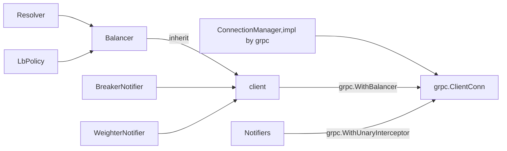

# 客户端实现

sheep库目前只对grpc客户端做了封装  
grpc go客户端相比cpp客户端的优势在于，留出了足够多的接口方便做扩展  
使得用户可以几乎不改变原生grpc客户端风格的情况下使用sheep库  

## 1 类关系图

由于github文档不支持mermaid  
上面代码复制粘贴到[这里](https://mermaidjs.github.io/mermaid-live-editor/#/edit/eyJjb2RlIjoiZ3JhcGggVERcblRlc3RcbiIsIm1lcm1haWQiOnsidGhlbWUiOiJkZWZhdWx0In19)查看效果  

## 2 类关系分析

* Resolver
对节点解析的封装，目前按需求只封装了etcd，一旦节点发生变化发送到LBPolicy  
* LbPolicy
带权重池的负载均衡策略的封装，提供3类接口供Resolver以及Notifiers通知修改池中节点优先级  
* BreakerNotifier
对熔断器的封装，一旦熔断会通知LbPolicy去下线节点  
* WeighterNotifier
对权重器的封装，目前只有RespTime实现，规则参考了netflix过滤器  
[netflix ResponseTimeWeightedRule](https://github.com/Netflix/ribbon/blob/master/ribbon-loadbalancer/src/main/java/com/netflix/loadbalancer/ResponseTimeWeightedRule.java)
* Balancer
Resolver和LbPolicy的管理器，是对grpc.Balancer接口的实现
* client
继承了Balancer，通过grpc.WithBalancer传入自己覆盖grpc默认Balancer  
同时将Resolver, BreakerNotifier, WeighterNotifier通过拦截器链模式合并，然后通过grpc.WithUnaryInterceptor传入拦截器  
拦截器链模式的解读在我的博客  
[拦截器链模式](http://weakyon.com/2018/12/18/design-patterns-visitor-mode.html#32-%E6%8B%A6%E6%88%AA%E5%99%A8%E9%93%BE%E6%A8%A1%E5%BC%8F)
* ConnectionManager
这是grpc封装的连接管理器，会对连接进行重连  
虽然不是我实现的，但是在文档中特意标注希望能使整个逻辑更清晰  
连接管理器和我实现的Balancer共同组成了ClientChannel概念，也就是grpc.ClientConn  
