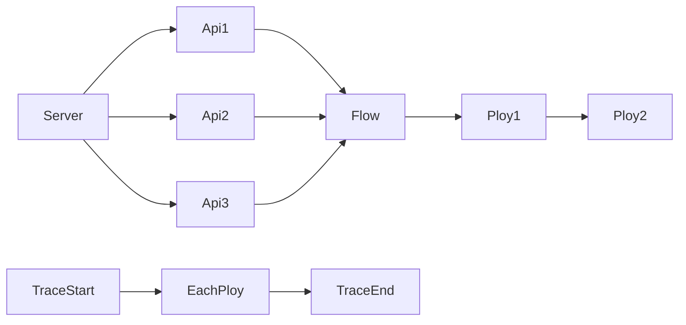

flow库使用

flow是责任链模式的封装  
在一个flow（流程）上插入各个ploy，逻辑会依次经过所有的ploy  

## 概念



[图](https://mermaidjs.github.io/mermaid-live-editor/#/view/eyJjb2RlIjoiZ3JhcGggTFJcblNlcnZlci0tPkFwaTFcblNlcnZlci0tPkFwaTJcblNlcnZlci0tPkFwaTNcbkFwaTEtLT5GbG93XG5BcGkyLS0-Rmxvd1xuQXBpMy0tPkZsb3dcbkZsb3ctLT5QbG95MVxuUGxveTEtLT5QbG95MlxuVHJhY2VTdGFydC0tPkVhY2hQbG95XG5FYWNoUGxveS0tPlRyYWNlRW5kIiwibWVybWFpZCI6eyJ0aGVtZSI6ImRlZmF1bHQifX0)

不同的Api Register同一个Server  
同一个Server都是使用相同的Flow，请求依次执行Flow上注册的各个Ploy
每个Ploy开始之前会执行TraceStart，结束以后执行TraceEnd

## 使用

具体可参考sheep/extends/flow/demo库

main实现
```
import (
    sheep_server "github.com/tedcy/sheep/server"
    "github.com/tedcy/sheep/extends/flow"
    "github.com/tedcy/sheep/common"
)

func main() {
    //配置用的还是sheep_server的ServerConfig
    var config sheep_server.ServerConfig
    config.Type = "grpc"
    config.Addr = ":8000"

    //建立一个server, 这里是对sheep的封装
    server, err := flow.NewServer(&config)
    common.Assert(err)

    //建立一个flow
    testApi := new(TestApi)
    biddingFlow, err = server.NewFlow(testApi)
    common.Assert(err)

    //复用一个flow
    //err = server.NewOverLappedFlow(implement, biddingFlow)

    //初始化flow
    initBidding(biddingFlow)

    //提供服务
    err = server.Serve()
    common.Assert(err)

    common.Hung()
}


func initBidding(flow flow.FlowI) {
    //在flow上添加trace
    flow.AddTrace(new(Trace))

    //在flow上添加ploy
    flow.AddPloy(new(RegionFilling))
    flow.AddPloy(new(RegionFilling1))
}
```

TestApi实现
```
import (
    "golang.org/x/net/context"
    "github.com/tedcy/sheep/extends/flow"
    "github.com/tedcy/sheep/extends/flow/demo/test"
)
type TestApi struct {
    flow.FlowI
}
type Request struct {
    Name        string
}
type Response struct {
    Message     string
}
func (this *TestApi) Handler(ctx context.Context, req *test.TestRequest) (rsp *test.TestResponse, err error) {
    iReq, err := this.reqTrans(req)
    if err != nil {
        return
    }
    iRsp := &Response{}
    
    //Executor是FlowI实现的接口，是Ploys的入口
    ctx = this.Executor(ctx, iReq, iRsp)
    if ctx != nil {
        err = ctx.Err()
        if err != nil {
            return
        }
    }
    rsp, err = this.rspTrans(iRsp)
    return
}
func (this *TestApi) reqTrans(testReq *test.TestRequest) (req *Request, err error) {
    req = &Request{}
    req.Name = testReq.Name
    // 协议转换
    return
}
func (this *TestApi) rspTrans(rsp *Response) (testRsp *test.TestResponse, err error) {
    testRsp = &test.TestResponse{}
    testRsp.Message = rsp.Message
    // 协议转换
    return
}
```

regin\_filling.go regin\_filling1.go

各个ploy，略

trace

```
type Trace struct {}
func (*Trace) PloyWillRun(ploy interface{}, ctx context.Context, req *Request, rsp *Response) context.Context {
    fmt.Printf("PloyWillRun %s\n",req.Name)
    return ctx
}
func (*Trace) PloyDidRun(ploy interface{}, ctx context.Context, req *Request, rsp *Response) context.Context {
    fmt.Printf("PloyDidRun %s\n",rsp.Message)
    return ctx
}
```
